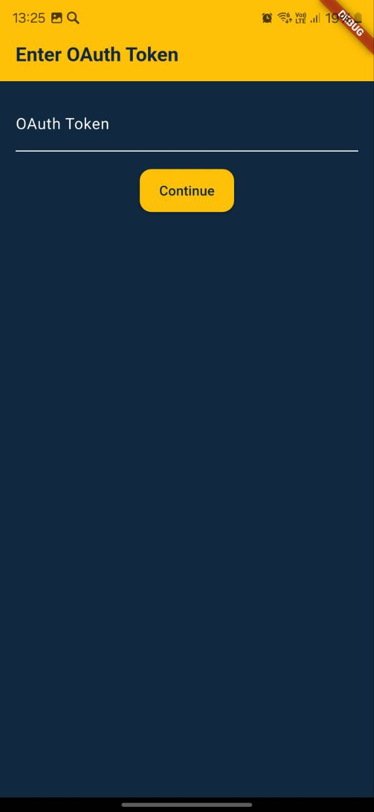
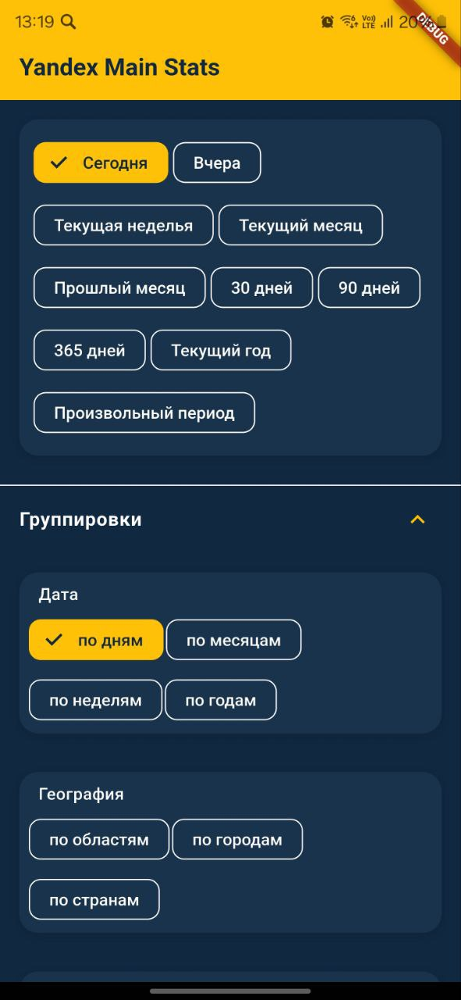
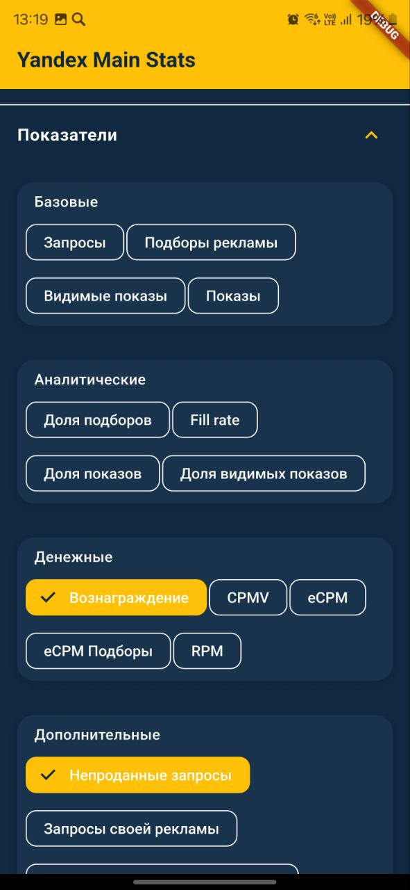

# YaAdsPartner 📊

**YaAdsPartner** is a Flutter application designed to help users monitor and visualize their Yandex Ads Monetization performance. With support for filters, custom date ranges, and clean UI themes, it's built for ease of use and flexible reporting.


---

## ✨ Features

- 📈 View detailed statistics from Yandex Ads (main stats)
- 🧩 Filter by indicators, dimensions, and entity fields
- 📆 Select from predefined periods or choose custom date ranges
- 💾 Data persistence with Shared Preferences
- 🌗 Multiple design themes (Casual, Techy, etc.)
- ⚡ Auto-pagination (infinite scroll) for large datasets

---

## 🚀 Getting Started

### 1. Clone the repo
```bash
git clone https://github.com/RobertTadevosyan/YandexAdsPartner.git
cd 'YandexAdsPartner'
```

### 2. Install dependencies
```bash
flutter pub get
```

### 3. Run the app
```bash
flutter run
```

---

## 🧰 Configuration

Before running, ensure you set up a valid **Yandex OAuth token**. You can hardcode it for testing or implement a secure auth flow.

---

## 📁 Folder Structure

```
lib/
├── models/            # Data models (TreeField, ReportPoint, etc.)
├── services/          # API service layer
├── widgets/           # UI components
├── screens/           # Pages/screens (MainPage, etc.)
├── theme/             # Color schemes and theming
└── main.dart          # Entry point
```

---

## 🎨 Design & Theming

Includes multiple theme presets:
- Casual (default)
- Dark Techy
- Material You
- Neumorphic (optional)

You can switch between them in `lib/theme/themes.dart`.

---

## 📦 Dependencies

- [`http`](https://pub.dev/packages/http) — API requests
- [`shared_preferences`](https://pub.dev/packages/shared_preferences) — Local storage
- [`intl`](https://pub.dev/packages/intl) — Date formatting
- [`flutter/material`](https://api.flutter.dev/flutter/material/material-library.html) — Core UI

---

## 📸 Screenshots

### OAuth Token Input


### Date Ranges And Groups


### Indicators


### Results


---

## 🔐 Where to Get the OAuth Token?

To access the Yandex Ads API, you need a **personal OAuth token**. Here's how to obtain it:

1. Go to your [Yandex Partner Dashboard](https://partner.yandex.ru/v2/dashboard/).
2. On the **right-side panel**, click the **"API" button** (labeled `API`).
3. Choose **"Получить OAuth-токен для API статистики"** (Get OAuth token for API statistics).
4. Copy the generated token and paste it into the app when prompted.

> 💡 Your token is saved securely in local preferences and reused automatically.


---

## 🛠️ Contributing

Pull requests are welcome! For major changes, please open an issue first.

---

## 📄 License

[MIT](LICENSE)

---

Made with ❤️ for monitoring your Yandex Ads revenue.
