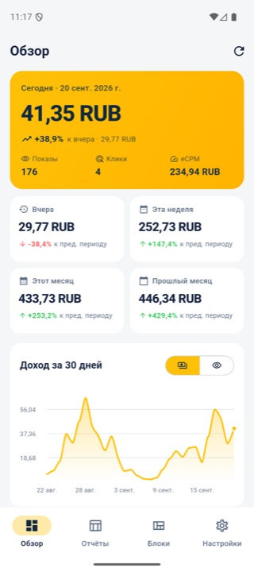
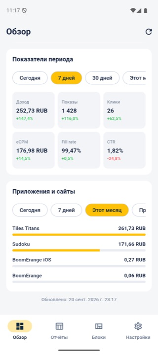
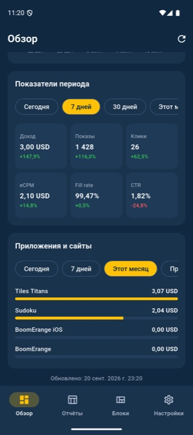
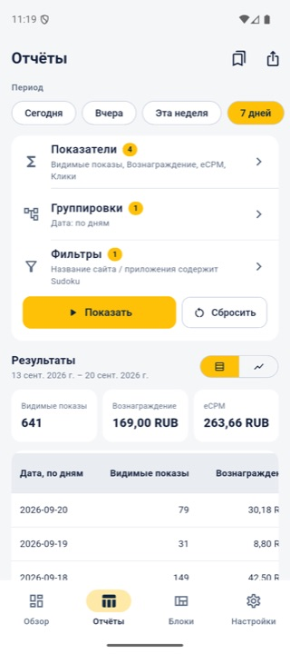
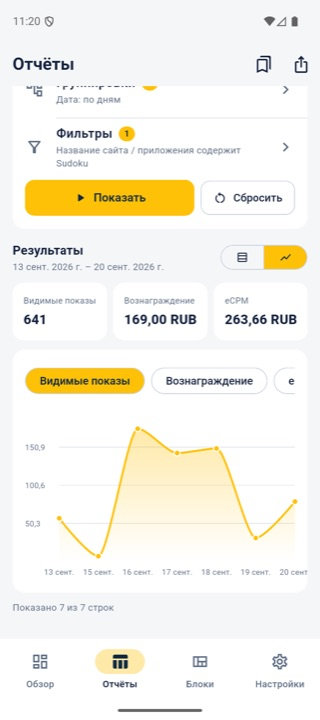
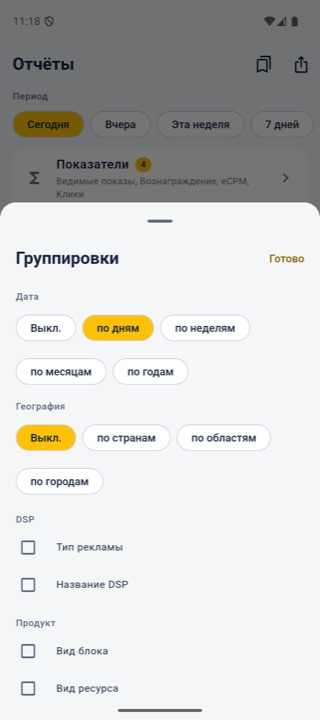
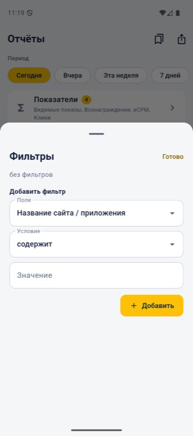
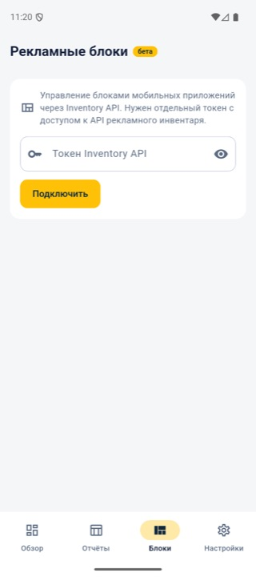
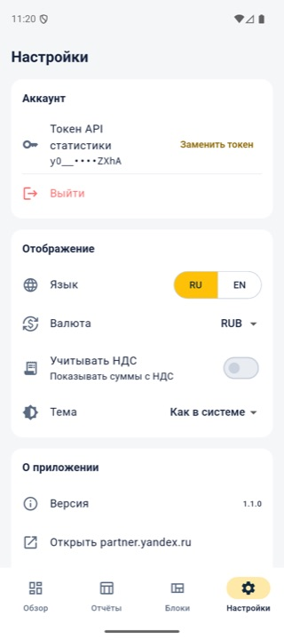
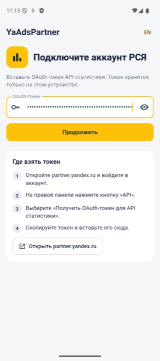

# AdPocket 📊

**AdPocket** is a Flutter app that puts the Yandex Advertising Network (YAN) partner dashboard in your pocket: monitor and visualize your ad monetization performance. With support for filters, custom date ranges, and clean UI themes, it's built for ease of use and flexible reporting.


---

## ✨ Features

**Overview tab** — the partner dashboard on one screen
- 💰 Today's revenue with change versus yesterday, plus yesterday / this week / this month / last month cards
- 📈 30‑day revenue or impressions trend chart with tooltips
- 🧮 eCPM, fill rate, CTR, impressions and clicks for today / 7 days / 30 days / this month, each with a delta
- 🏆 Top apps and sites by revenue for a selectable period; tap one to open its daily report
- 🔄 Pull to refresh, last‑updated time, cached data shown instantly on launch

**Reports tab** — everything the web statistics page can build
- 🗂 Report types: Main, Mobile Mediation, SSP, DSP, each with its own metric catalogue
- 📆 Period presets (today … this year) and a custom date range
- 🧩 Metrics, groupings (by day / week / month / year, geography, app, block, OS, browser, …) and filters with `=`, `<>`, `LIKE`, `IN`
- 📊 Totals strip, sortable table (tap a metric header), chart view, "Load more" pagination
- 🔖 Saved report presets and CSV export via the share sheet

**Ad units tab (beta)** — mobile ad units through the Inventory API
- 📱 List active / archived units grouped by app, edit caption and CPM‑floor strategy, archive

**Accounts** — several YAN accounts side by side: add, switch from the Overview avatar, rename, replace token, remove; caches, presets and the widget follow the active account

**Settings** — RU / EN interface (also applied to API labels), currency (RUB, USD, EUR, KZT, BYN, AMD, AED), VAT on/off, light / dark / system theme, token management

**Home-screen widgets** — today's revenue, change vs yesterday, a 7-day sparkline and impressions / clicks / eCPM, with a refresh button on the widget itself. Tapping the widget opens the app.
- *Android*: add it from Settings → Home-screen widget or the launcher's widget picker; a 30-minute background refresh can be switched on and off in Settings, "Refresh now" updates immediately.
- *iOS*: WidgetKit widget in small, medium and Lock Screen sizes (long-press the Home Screen → "+" → AdPocket). It refreshes itself about every 30 minutes by calling the Statistics API with the token shared through the app's keychain access group, and whenever the app opens. Requires iOS 16; the refresh button needs iOS 17.

**Notifications** — local only, no push servers: a daily summary at a chosen time (yesterday's revenue, impressions, eCPM), a monthly summary on the 1st, and alerts when yesterday's revenue falls below half the weekly average or there are no impressions by midday Moscow. Texts are recomputed on every data refresh.

**Privacy** — no server, no analytics, no ads; the bilingual policy in [docs/privacy-site](docs/privacy-site/) is published at https://roberttadevosyan.github.io/privacy/app.adpocket.yan/ and linked from Settings. On Android the app asks to be excluded from battery optimisation when the widget's background refresh is on, with vendor-specific hints (Samsung, Xiaomi, Huawei, OPPO, vivo).

**Security** — tokens are kept in the platform secure store (Android Keystore / iOS Keychain), never in plain preferences; an optional **App lock** asks for fingerprint, face or the device PIN whenever the app opens or returns from the background

See [docs/PRODUCT_PLAN.md](docs/PRODUCT_PLAN.md) for the audit, market review, decisions and roadmap.

---

## 🍎 iOS notes

- Deployment target is iOS 14 (app) / iOS 16 (widget). The widget target `AdPocketWidgetExtension` shares the App Group `group.app.adpocket.yan` with the app; both entitlement files are in the repo. With your own Apple team, enable the App Group for both bundle ids in the developer portal.
- `packages/workmanager_apple` is a vendored copy of the plugin with a compile guard for iOS 26-only APIs so the project builds on Xcode 16. Drop the `dependency_overrides` entry once upstream ships the fix or CI runs Xcode 26.

## 🚀 Getting Started

### 1. Clone the repo
```bash
git clone https://github.com/RobertTadevosyan/YandexAdsPartner.git
cd 'YandexAdsPartner'
```

### 2. Install dependencies
```bash
flutter pub get
```

### 3. Run the app
```bash
flutter run
```

---

## 🧰 Configuration

On first launch the app asks for a **Statistics API OAuth token** and validates it against the API before saving it on the device (see below).
The optional **Ad units** tab needs a second token for the *ad unit configuration API* (Advertising Inventory Management API). It is different from the statistics token:

1. Access is granted on request — contact YAN support (form or chat inside partner.yandex.ru) and ask for access to the in‑app ads API. See the [Inventory API docs](https://yandex.ru/dev/partner-statistics/doc/en/reference/in-app-api).
2. Once approved, open partner.yandex.ru, tap the **API** icon on the right panel and choose **"Получить OAuth‑токен для API настройки блоков"**.
3. Paste that token on the Ad units tab. Apps must already exist in the partner interface; the API manages only ad units inside them.

The same steps are shown inside the app on the Ad units tab.

---

## 📁 Folder Structure

```
lib/
├── core/              # Settings, session, strings (RU/EN), formatting, periods
├── models/            # TreeField, TreeCatalog, ReportResponse, filters, presets, ad units
├── services/          # Statistics API, Inventory API, token storage, cache
├── screens/           # Dashboard, Reports, Ad units, Settings, onboarding, shell
├── widgets/           # KPI cards, charts, period chips, picker sheets, table
├── theme.dart         # Light and dark brand themes
└── main.dart          # Entry point
test/                  # Unit + widget tests (API decoding, models, formatting, token flow)
docs/PRODUCT_PLAN.md   # Audit, market review, decisions, roadmap
```

---

## 🎨 Design & Theming

Navy‑and‑amber brand palette with light and dark variants (`lib/theme.dart`); the theme follows the system setting by default and can be forced in Settings.

---

## 📦 Dependencies

- [`http`](https://pub.dev/packages/http) — API requests (bodies decoded as UTF‑8 explicitly)
- [`fl_chart`](https://pub.dev/packages/fl_chart) — Trend charts
- [`provider`](https://pub.dev/packages/provider) — Settings / session state
- [`flutter_secure_storage`](https://pub.dev/packages/flutter_secure_storage) — Keystore / Keychain token storage
- [`local_auth`](https://pub.dev/packages/local_auth) — Optional biometric / PIN app lock
- [`flutter_local_notifications`](https://pub.dev/packages/flutter_local_notifications) + [`timezone`](https://pub.dev/packages/timezone) — local summaries and alerts
- [`home_widget`](https://pub.dev/packages/home_widget) + [`workmanager`](https://pub.dev/packages/workmanager) — home-screen widgets (Android background refresh; iOS WidgetKit target in `ios/AdPocketWidget`)
- [`shared_preferences`](https://pub.dev/packages/shared_preferences) — Settings, presets and report cache
- [`intl`](https://pub.dev/packages/intl) — Number and date formatting
- [`share_plus`](https://pub.dev/packages/share_plus) — CSV export
- [`url_launcher`](https://pub.dev/packages/url_launcher) — Links to partner.yandex.ru and the docs

---

## 📸 Screenshots

| Overview | Period metrics & top apps | Dark theme |
|---|---|---|
|  |  |  |

| Report builder | Chart view | Groupings |
|---|---|---|
|  |  |  |

| Filters | Ad units (beta) | Settings |
|---|---|---|
|  |  |  |

---

## 🔐 Where to Get the OAuth Token?

To access the Yandex Ads API, you need a **personal OAuth token**. Here's how to obtain it:

1. Go to your [Yandex Partner Dashboard](https://partner.yandex.ru/v2/dashboard/).
2. On the **right-side panel**, click the **"API" button** (labeled `API`).
3. Choose **"Получить OAuth-токен для API статистики"** (Get OAuth token for API statistics).
4. Copy the generated token and paste it into the app when prompted.

> 💡 The app validates the token against the API before saving it in the platform secure store, and reuses it automatically.



---

## 🛠️ Contributing

Pull requests are welcome! For major changes, please open an issue first.

---

## 📄 License

[MIT](LICENSE)

---

Made with ❤️ for monitoring your Yandex Ads revenue.
